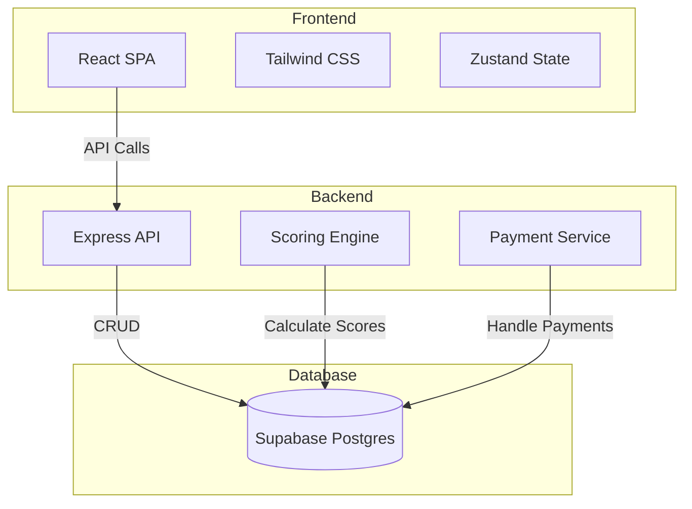
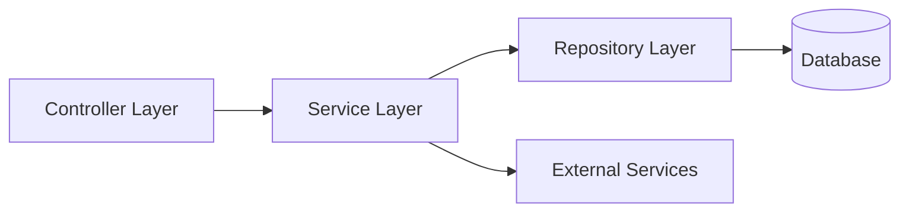

## 1. Architecture Design



## 2. Technology Description
- Frontend: React@18 + TypeScript + TailwindCSS@3 + Vite
- Initialization Tool: vite-init
- Backend: Express@4 + TypeScript
- Database: Supabase (PostgreSQL)
- State Management: Zustand
- Routing: React Router DOM
- Payment: 微信支付

## 3. Route Definitions
| Route | Purpose |
|-------|---------|
| / | 首页 |
| /test | 答题页 |
| /payment | 支付页 |
| /result | 结果页 |
| /history | 历史记录页 |

## 4. API Definitions

### Types
```typescript
interface Question {
  q_id: number;
  title: string;
  dim_main: 'EI' | 'SN' | 'TF' | 'JP';
  opt_a: string;
  score_a: 'E' | 'I' | 'S' | 'N' | 'T' | 'F' | 'J' | 'P';
  opt_b: string;
  score_b: 'E' | 'I' | 'S' | 'N' | 'T' | 'F' | 'J' | 'P';
}

interface Answer {
  answer_id: string;
  user_id?: string;
  ans_arr: ('A' | 'B')[];
  create_time: Date;
  cost_sec: number;
  is_valid: boolean;
}

interface Score {
  answer_id: string;
  E: number;
  I: number;
  S: number;
  N: number;
  T: number;
  F: number;
  J: number;
  P: number;
  mbti_type: string;
  border_flag: boolean;
}
```

### Endpoints
- `GET /api/questions` - 获取所有题目
- `POST /api/answers` - 提交答案
- `POST /api/calculate` - 计算分数
- `GET /api/result/:id` - 获取结果
- `POST /api/payment` - 创建支付订单

## 5. Server Architecture Diagram



## 6. Data Model

### 6.1 Data Model Definition

```mermaid
erDiagram
    USER ||--o{ ANSWER : submits
    ANSWER ||--|| SCORE : has
    USER {
        string id PK
        string openid
        string nickname
        datetime created_at
    }
    ANSWER {
        string id PK
        string user_id FK
        text ans_arr
        int cost_sec
        boolean is_valid
        datetime create_time
    }
    SCORE {
        string answer_id PK FK
        smallint E
        smallint I
        smallint S
        smallint N
        smallint T
        smallint F
        smallint J
        smallint P
        string mbti_type
        boolean border_flag
    }
```

### 6.2 Data Definition Language

```sql
-- Users Table
CREATE TABLE users (
    id UUID DEFAULT gen_random_uuid() PRIMARY KEY,
    openid VARCHAR(255),
    nickname VARCHAR(255),
    created_at TIMESTAMPTZ DEFAULT NOW()
);

-- Questions Table
CREATE TABLE questions (
    q_id INT PRIMARY KEY,
    title VARCHAR(512) NOT NULL,
    dim_main CHAR(2) NOT NULL,
    opt_a VARCHAR(256) NOT NULL,
    score_a CHAR(1) NOT NULL,
    opt_b VARCHAR(256) NOT NULL,
    score_b CHAR(1) NOT NULL
);

-- Answers Table
CREATE TABLE answers (
    answer_id UUID DEFAULT gen_random_uuid() PRIMARY KEY,
    user_id UUID REFERENCES users(id),
    ans_arr TEXT NOT NULL,
    cost_sec INT NOT NULL,
    is_valid BOOLEAN DEFAULT TRUE,
    create_time TIMESTAMPTZ DEFAULT NOW()
);

-- Scores Table
CREATE TABLE scores (
    answer_id UUID PRIMARY KEY REFERENCES answers(answer_id),
    E SMALLINT DEFAULT 0,
    I SMALLINT DEFAULT 0,
    S SMALLINT DEFAULT 0,
    N SMALLINT DEFAULT 0,
    T SMALLINT DEFAULT 0,
    F SMALLINT DEFAULT 0,
    J SMALLINT DEFAULT 0,
    P SMALLINT DEFAULT 0,
    mbti_type VARCHAR(10),
    border_flag BOOLEAN DEFAULT FALSE
);

-- Payments Table
CREATE TABLE payments (
    payment_id UUID DEFAULT gen_random_uuid() PRIMARY KEY,
    user_id UUID REFERENCES users(id),
    answer_id UUID REFERENCES answers(answer_id),
    amount DECIMAL(10,2),
    status VARCHAR(50),
    transaction_id VARCHAR(255),
    created_at TIMESTAMPTZ DEFAULT NOW()
);

-- Enable RLS
ALTER TABLE questions ENABLE ROW LEVEL SECURITY;
ALTER TABLE answers ENABLE ROW LEVEL SECURITY;
ALTER TABLE scores ENABLE ROW LEVEL SECURITY;
ALTER TABLE payments ENABLE ROW LEVEL SECURITY;

-- RLS Policies
CREATE POLICY "Allow public read access to questions" ON questions
    FOR SELECT USING (true);

CREATE POLICY "Allow insert to answers" ON answers
    FOR INSERT WITH CHECK (true);

CREATE POLICY "Allow read own answers" ON answers
    FOR SELECT USING (user_id = auth.uid());

CREATE POLICY "Allow insert to scores" ON scores
    FOR INSERT WITH CHECK (true);

CREATE POLICY "Allow read own scores" ON scores
    FOR SELECT USING (
        EXISTS (
            SELECT 1 FROM answers
            WHERE answers.answer_id = scores.answer_id
            AND (answers.user_id = auth.uid() OR answers.user_id IS NULL)
        )
    );
```
