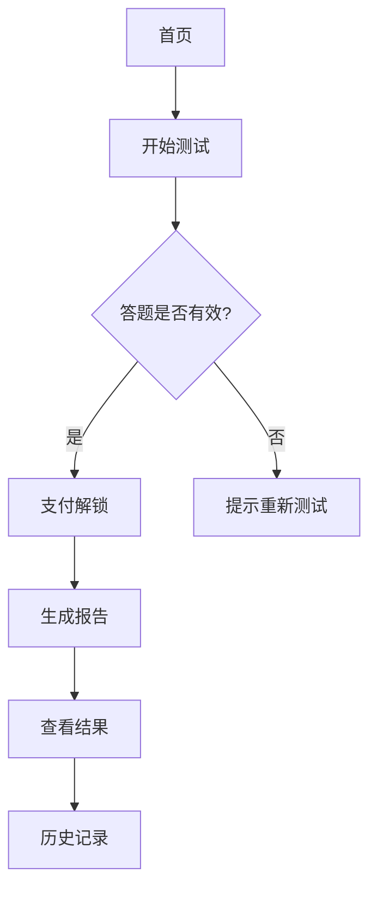

## 1. Product Overview
MBTI 93题标准版测评系统 - 提供专业的MBTI性格测试，支持付费解锁完整报告，可在微信小程序/公众号发布。解决用户完成93题二选一题目后，通过专业计分引擎计算四维度分数，生成详细的性格分析报告。

## 2. Core Features

### 2.1 User Roles
| Role | Registration Method | Core Permissions |
|------|---------------------|------------------|
| 普通用户 | 微信授权/手机号登录 | 免费体验部分题目，付费解锁完整测试和报告 |
| 付费用户 | 支付完成 | 完整93题测试，查看详细报告 |

### 2.2 Feature Module
1. **首页**: 英雄区、测试介绍、开始测试按钮
2. **答题页**: 93题二选一答题，进度显示，答题计时
3. **支付页**: 支付选项、支付状态
4. **结果页**: 四维度分数展示、MBTI类型、详细性格报告
5. **历史记录页**: 用户历史测试记录

### 2.3 Page Details
| Page Name | Module Name | Feature description |
|-----------|-------------|---------------------|
| 首页 | Hero section | 引人注目的标题和介绍，引导用户开始测试 |
| 首页 | 功能介绍 | MBTI测试简介，四维度说明 |
| 答题页 | 题目展示 | 单题二选一，支持前进后退，进度条显示 |
| 答题页 | 计时系统 | 实时记录答题时间，防止过快答题 |
| 支付页 | 支付选项 | 显示价格，支付方式选择 |
| 结果页 | 结果展示 | MBTI类型，四维度分数雷达图 |
| 结果页 | 详细报告 | 性格特点、职场建议、情感建议 |
| 历史记录 | 记录列表 | 展示历史测试记录 |

## 3. Core Process
用户进入首页 → 点击开始测试 → 完成93题答题 → 系统验证答题有效性 → 支付解锁 → 生成MBTI类型 → 展示详细报告 → 可查看历史记录

## 4. User Interface Design
### 4.1 Design Style
- 主色调：深紫色 (#6C5CE7，代表专业与神秘
- 辅助色：淡紫色 (#A29BFE
- 按钮风格：圆角矩形，渐变背景，hover上浮动画
- 字体：使用 Noto Sans SC，现代清晰
- 布局：卡片式布局，清晰的信息层级
- 图标风格：简约线性图标，风格统一

### 4.2 Page Design Overview
| Page Name | Module Name | UI Elements |
|-----------|-------------|-------------|
| 首页 | Hero section | 渐变背景，大气标题，居中布局，动态效果 |
| 答题页 | 题目卡片 | 卡片式设计，两选项并排，进度动画 |
| 结果页 | 雷达图 | 四维度分数可视化 |
| 报告页 | 内容展示 | 分段式展示，渐入动画 |

### 4.3 Responsiveness
移动端优先设计，完美适配微信小程序/公众号，触摸交互优化

### 4.4 特殊优化
- 加载动画、交互动画，视觉反馈，流畅过渡
